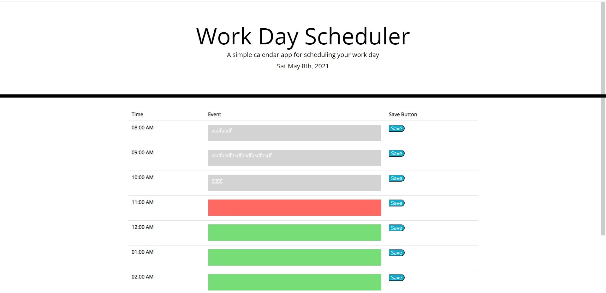

# 05-homework
Title: Work Day Scheduler

This website has a scheduler for each hour of the work day.  The real-time date is displayed at the top.  every hour has a text field that can save to local storage and will remain if page is refreshed.  The text boxes are also color-coded based on the current time past:grey, present:red, future:green.

https://jsumis.github.io/05-homework/